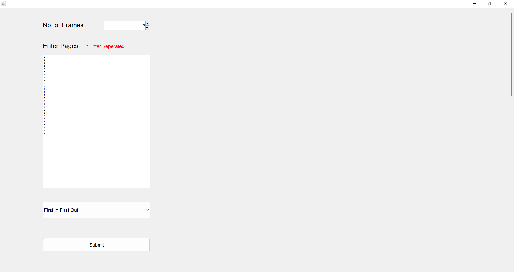

# Page Replacement Simulator

## Description

This app is a simulation to replicate the visualization of different types of page replacement algorithms which includes:

<ol>
    <li>First In First Out</li>
    <li>Least Recently Used</li>
    <li>Optimal</li>
</ol>

## Input Screen

## Output Screens

### First In First Out

### Least Recently Used

### Optimal
